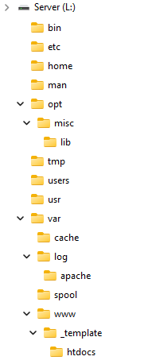

# Build it and it will work!

## Four Easy Steps

There are 4 steps to this process:
1. Create a secondary partition (I will leave that as an exercise for the reader!) or install a secondary drive
2. Add the [Environmental Variables](./Fusion/env_vars.md) to make the magic work.
3. Download the [superstructure ZIP file](./Fusion/assets/superstructure.zip) to give you an "instant framework".
4. Download the [CMD Tools](./Fusion/assets/cmd_tools.zip) to give you an "instant toolset".

### Step One
The first step is all up to you. But when you're done, please give it (the dreaded) Volume Letter of 'L' (For Linux!). You can give it any letter you like, but the predefined environmental variables all assume 'L'. I also suggest you format it using FAT32, not NTSF. That way you can open this volume using any other OS. Otherwise, you have to install Windows to recover this volume.

### Step Two
There is a collection of [Environmental Variables](./Fusion/env_vars.md) than need to be defined.

### Step Three
Unzip the ['superstructure.zip'](./Fusion/assets/superstructure.zip) into it. What you get should look like this...

This will give you 18 directories and only 4 files. We'll get into those 4 files later.

## Step Four
This is a collection of over 200 command line tools I've collected over the years.

Due to various reasons over the years I have lost the references to these tools.

Down load this [ZIP file](./Fusion/assets/cmd_tools.zip) and unpack it onto your "L" drive.

## Step Five
Now you can install whichever [Linux App](./Fusion/start.md) you are interested in.

> No, I don't have IIS in this framework. Many of the tools will still work, as they are command-line based, but I've not looked into getting the ones needing a web server to work with IIS. Nor will I. Now, if someone would like to contribute an IIS section to this site, I'll more than welcome it.
