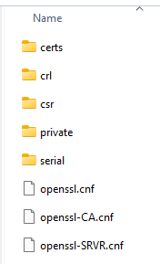

# Configuring OpenSSL

OpenSSL, an open-source tool, is a robust cryptographic library widely used to secure communications over computer networks. Its versatility and powerful encryption algorithms make it an essential tool for many developers and system administrators. Configuring OpenSSL on a Windows environment can seem daunting for beginners, but with step-by-step guidance, you can swiftly set it up and harness its capabilities.

### Download and Installation

- Pull the latest binary from `https://wiki.overbyte.eu/wiki/index.php/ICS_Download`
- Decompress package into `L:\etc\openssl`
- Add new ENVIRONMENTAL VARIABLE
  - Name: openssl
  - Value: `%etc%\openssl`
- Add `%openssl%` to PATH
- Verify your installation with this command prompt
  - Open Command Window
  - Enter: `openssl version`
  - It should respond with (or something similar):
```shell
OpenSSL 3.1.3 19 Sep 2023 (Library: OpenSSL 3.1.3 19 Sep 2023)
```

# Certificates

There are 3 types of certificates;
1. (Self-signing) Signing Certificate Authority [**CA**]
2. Certificate Signing Request [**CSR**]
3. Domain level Certificates

The first 2 certificate are needed once and required for the third.
The third is needed for each virtual host utilized.

## First off...

Download our customized version of the [OPENSSL CNF files](../assets/openssl.zip), it will make your life a **LOT** easier. The complete details on "How and Why" of the customized OPENSSL CNF files can be [read here.](./cnf.md) Unpack this file into `L:/etc/openssl`. The package creates a `CA` directory with a set of subdirectories and a couple of files.



> IMPORTANT: The direction of the "slash" characters are important. OPEENSSL commands are forward slash '/'. CLI commands are backwward slash '\'

Change to the new "**CA**" directory.
```shell
C:/> cd L:\etc\openssl\CA
```

## (Self-signing) Signing Certificate Authority [CA]

### 1. Generate Random Value
```shell
L:> for /f "delims=" %i in ('powershell -command "& {[math]::Floor((Get-Random -Minimum 1000000000000000 -Maximum 9999999999999999))}"') do set "gen_rand=%i"
```

### 2. Create a random seed file:
```shell
openssl rand -out ./private/RND 4096
```

### 3. Generate the Root Key and remove the random seed file
```shell
openssl genrsa -rand ./private/RND -out ./private/rootCA.key 2048
del .\private\RND
```

### 4. Create the Root CA Certificate Signing Request (CSR):
```shell
openssl req -new -key ./private/rootCA.key -out ./csr/rootCA.csr -config .\openssl-CA.cnf
```

### 5. Generate the Root CA Self-Signed Certificate:
```shell
openssl x509 -req -days 3650 -in ./csr/rootCA.csr -signkey ./private/rootCA.key -out ./certs/rootCA.crt
```

## Server Certificate

### 1. Generate Random Value
```shell
L:> for /f "delims=" %i in ('powershell -command "& {[math]::Floor((Get-Random -Minimum 1000000000000000 -Maximum 9999999999999999))}"') do set "gen_rand=%i"
```

### 2. Create a random seed file:. Create a random seed file:
```shell
openssl rand -out ./private/RND 4096
```

### 3. Generate the Root Key and remove the random seed file
```shell
openssl genrsa -rand ./private/RND -out ./private/server.key 2048
del .\private\RND
```

### 4. Create the Root CA Certificate Signing Request (CSR):
```shell
openssl req -new -key ./private/server.key -out ./csr/server.csr -config ./openssl-SRVR.cnf
```

### 5. Generate the Root CA Self-Signed Certificate:
```shell
openssl x509 -req -days 3650 -in ./csr/server.csr -CA ./csr/rootCA.csr -CAkey ./private/rootCA.key -set_serial %gen_rnd% -out ./certs/server.crt -extensions v3_req -extfile ./openssl-SRVR.cnf
```